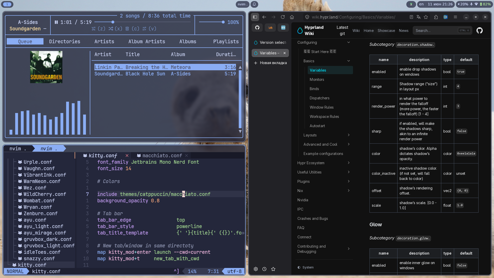

# Dotfiles

There is config for GNOME/hyprland that I use with **Alt Linux Sisyphus** (Alt Gnome).

### Extra dependencies

For `screenshot-ocr`:

- `slurp`
- `grim`
- `tesseract`, `tesseract-langpack-en`, `tesseract-langpack-ru`
- `wl-clipboard`
